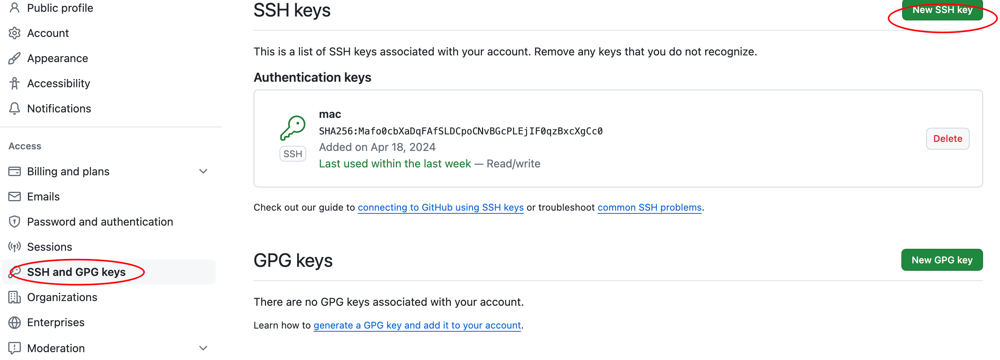

sgitee

```bash
#Git 全局设置:

git config --global user.name "hxh"
git config --global user.email "linux.hxh@outlook.com"

#创建 git 仓库:
# 远程仓库无内容时按以下流程:
mkdir gitdemo
cd gitdemo
git init 
touch README.md
git add README.md # 添加文件到暂存区  
git rm --cached README.md # 将文件移除暂存区
git commit -m "first commit"
git remote add origin https://gitee.com/hxhabc/gitdemo.git
git push -u origin "master"

# 远程仓库有初始自带的文件时:
# 先拉取远程仓库的内容  再上传
git pull --rebase origin master
git push -u origin master

#已有仓库?
cd existing_git_repo
git remote add origin https://gitee.com/hxhabc/gitdemo.git
git push -u origin "master"
```


# 速查

### 1. 初始化仓库

```bash
git config --global user.name "hxh"
git config --global user.email "linux.hxh@outlook.com"

mkdir git-demo
cd git-demo
git init 
touch README.md
git add README.md
git commit -m "first commit"
git remote add origin git@gitee.com:hxhabc/git-demo.git
git push -u origin "master"

# n次提交产生的n个版本,切换到其他版本
# git log 查看commit的信息,找到commit对应的指针
git reset --hard [目标版本指针]
```


### 2. 路由

```bash
# 查看路由
git remote -v

# 添加路由 路由名称建议根项目名一致
git remote add git-demo git@gitee.com:hxhabc/test.git

# 修改路由名称 
git remote rename git-demo demo

# 删除路由
git remote remove demo
```


### 3. 提交

```bash
# 添加指定文件到暂存区
git add a.txt

# 提交当前目录下所有文件到暂存区 == git追踪指定文件
git add .

# 将暂存区文件提交到本地仓库
git commit -m '提交描述信息'

# 恢复被误删暂存区的文件
git checkout .

# 取消暂存区指定的文件 == git取消追踪指定文件,只会删除提交到暂存区的文件
git rm --cached a.tx
git commit -m 'del a.txt'
git push gitdemo main  # git rm --cached a.txt如果之前远程仓库推送了a.txt  这个文件会在这次推送后被删除

# 会删除暂存区和本地的 c.txt
git rm -f c.txt

# 将文件a.txt 从暂存区丢弃
git restore --staged a.txt

# 此时的文件a.txt修改了内容,此命令的作用是放弃文件a.txt修改的内容
git restore a.txt
```


### 4. 推送

```bash
# 在本地仓库的任意分支内推送任意分支到远程仓库
# push的内容不必本地仓库内是最新的一次提交,任意版本的push
git push git-demo master
git push git-demo dev

# 推送标签指定标签
git push git-demo v1.0

# 推送所有本地标签到远程仓库
git push git-demo --tags
```


### 5. 分支

```bash
# 查看当前分支
git status [git branch]

# 修改当前分支名称为 main
git branch -m main

# 查看本地分支
git branch -v 

# 查看远程分支
git branch -r

# 查看本地和远程分支 
git branch -a

# 创建分支
git branch dev

# 切换分支
git checkout dev

# 删除本地分支
git branch -d dev # dev这个分支未合并,删除前会提醒
git branch -D dev #强制删除

# 删除远程分支
git push git-demo --delete dev
git push git-demo :dev
```


### 6. 查看

```bash
# 查看git状态
git status

# 查看版本提交的详细信息
git log

# 查看指针引用记录的信息
git reflog

# 查看路由信息
git remote -v

# 查看标签信息
git tag -l
git tag shwo v1.0
```


### 7. 标签

```bash
# 每一个标签对应着一次提交记录 commit
# 查看标签
git tag

# 当前指针所在的位置,创建轻量级标签
git tag v1.0

# 指定提交版本创建标签
git tag v2.0

# 创建详细标签
git tag -a v1.1 -m 'v1.1'

# 查看标签的详细信息
git tag show v1.0

# 推送指定本地标签到远程仓库
git push git-demo v1.0

# 推送所有本地标签到远程仓库
git push git-demo --tags

# 删除本地标签
git tag -d v2.0

# 删除远程标签
git push git-demo -d v2.0

# 切换历史标签
# 正处于分离头指针状态。您可以查看、做试验性的修改及提交，并且您可以在切换回一个分支时，丢弃在此状态下所做的提交而不对分支造成影响
git checkout v1.0 # 可以在历史分支做局部修改
git checkout master # 切回其他分支放弃在当前标签修改的内容

# 指针位于在历史标签中修改局部内容,可以通过创建一个新分支保存内容
# 将当前修改的内容添加到暂存区(git追踪修改文件)
git add .
# 创建新分支test 保存修改
git switch -c test
```


### 8. 合并

```bash
# 将dev分支合并到当前指针所在的分支,分支中的文件无冲突
git merge dev

# 分支文件有冲突,找到冲突的文件,修改要保存内容
>>>EOF

aanbbbbb
<<<<<<< HEAD
dsahellowsasd
=======
aanbbbbb
>>>>>>> dev

------------------------------
aanbbbbb
dsahellowsasd

EOF

# 提交修改的文件
git add . 

# 合并分支,解决冲突,不能做局部提交
git commit
```


### 9.ssh代理

```bash
<< EOF
当路由的地址是由ssh协议传输,而不是使用https协议,特殊情况下可能需要开代理才能访问到github.com
git@github.com:xh-ss/note.git 这种就是使用ssh协议通信
https://gitee.com/hxhabc/gitdemo.git 这种就是使用http协议与通信
proxyCommand nc -x 127.0.0.1:1080 %h %p 配置代理服务器的ip,端口
1080端口并不是一个固定值,它与代理服务器配置的socks端口匹配
EOF

vim ~/.ssh/config
#------------------
Host github.com
	HostName github.com
	User git
	proxyCommand nc -x 127.0.0.1:1080 %h %p
#-----------------
```


### 10.gitlab

```bash
# 离线安装gitlab
# 1.下载gitlab rpm安装包
wget https://mirrors.tuna.tsinghua.edu.cn/gitlab-ce/yum/el7/gitlab-ce-13.11.3-ce.0.el7.x86_64.rpm --no-check-certificate

# 2.安装rpm包,安装过程中如果缺什么依赖,需要另外下载
rpm -ivh gitlab-ce-13.11.3-ce.0.el7.x86_64.rpm

# 3.修改base_url
vim /etc/gitlab/gitlab.rb
#------------------
# 修改成自己的服务器或者虚拟机ip,任意端口都可以
external_url 'http://192.168.10.231:80'
#------------------
# sed -Ei.backup 's/^external_url*$/external_url \"http:\/\/192\.168\.10\.231:80\"/' gitlab.rb

# 4.初始化gitlab,设置gitlab开启自启,关闭防火墙,然后重启gitlab
gitlab-ctl reconfigure 
systemctl enable gitlab-runsvdir.service
systemctl start gitlab-runsvdir.service
systemctl disable firewalld
systemctl stop firewalld
gitlab-ctl restart

# 浏览器访问gitlab,默认用户是root
# 默认密码在第一次初始化后会在/etc/gitlab/下生一个initial_root_password文件，会将密码写入该文件，该文件只保留24小时

# 如果没有该文件
cd /opt/gitlab/bin
gitlab-raiUser.all   #查看所有用户，目前应该只有一个root用户
u=User.where(id:1).first   #找到该root用户
u.password='abcd1234'     #将其密码重置
u.password_confirmation='abcd1234'   #确认密码
u.save                      #保存
exit                         #退出控制台进程ls console

```


### 常见的问题

#### 1.ssh免密登录

##### 1.1 生成秘钥对

```bash
# 进入ssh密钥对保存的目录
cd ~/.ssh

# 生成密钥对 id_rsa(私钥)   id_rsa_pub(公钥)
# 期间按三次回车,生成密钥对
# -f 指定生成密钥的文件名  不指定的话默认就是 id_rsa
ssh-keygen -t rsa -f id_github

# 将公钥上传到需要免密登录的服务器, 提示输入root用户的登录密码
# -i 是指定密钥对保存的位置 root用户名 192.169.1.1 目标IP  端口默认22
ssh-copy-id -i ./id_rsa.pub hxh@192.169.1.1  # 建议使用非 root 用户 防止暴力破解密码

ssh-add -k ./id_github  # mac系统需要加上这一步
# 免密登录服务器
ssh hxh@192.168.0.1

# 查看服务器保存的公钥
cd ~/.ssh
cat authorized_keys

# SSH进行认证的过程中除了对用户目录有权限要求外，对服务器上的 .ssh 文件夹和 authorized_keys 文件同样也要限制，如果日志中提示这两个的问题，可以通过如下方式进行修改：
chmod 700 ~/.ssh
chmod 600 ~/.ssh/authorized_keys

<<EOF
另外用 Mac OSX Terminal ssh 命令连接服务器之后，如果一段时间不操作，就会退出登录并出现如下错误提示：
Write failed: Broken pipe
只能重新用 ssh 命令进行连接。
解决方法
方法一：$ ssh -o ServerAliveInterval=60 user@IP

方法二：只需在服务器的 /etc/ssh/sshd_config 中添加如下的配置：

添加或者修改ClientAliveInterval为“ClientAliveInterval 60”。这个参数的是意思是每1分钟，服务器向客户端发一个消息，用于保持连接。保存后记得重启ssh服务
EOF
# 移除免密登录,可以直接删除 authorized_keys(可保存多个服务器的公钥) 文件保存的指定服务器公钥的内容
```

##### 1.2 github免密登录

将生成的公钥保存到github中 `cat ~/.ssh/id_github.pub`




测试ssh免密登录是否成功

`ssh -T git@github.com`
