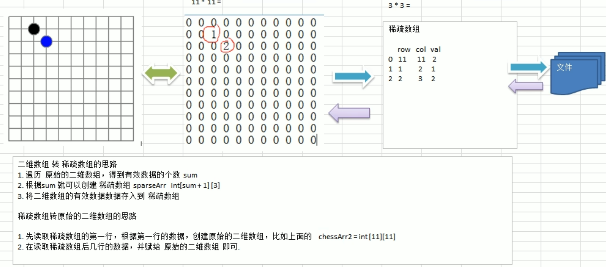
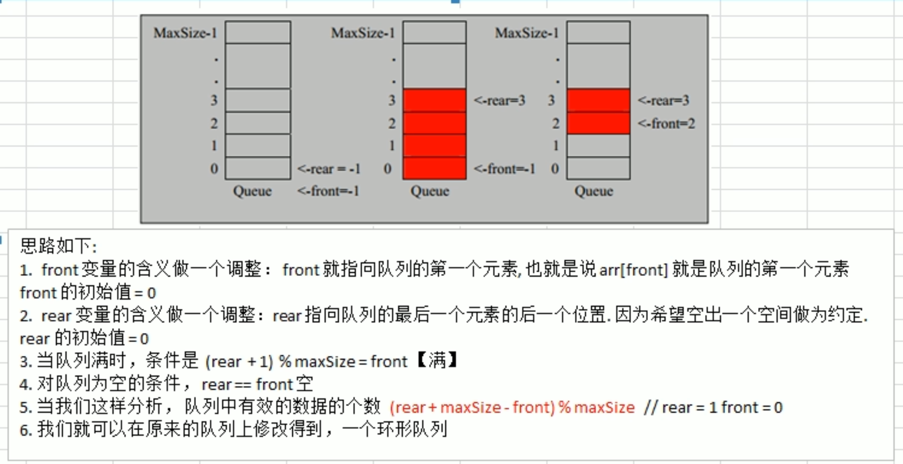

### 概述

#### 1.数据结构与算法的关系

>数据data结构（structure）是一门研究组织数据方式的学科，有了编程语言也就有了数据结构.学好数据结构可以编写出更加漂亮，更加有效率的代码。要学习好数据结构就要多多考虑如何将生活中遇到的问题，用程序去实现解决.程序 =数据结构＋算法数据结构是算法的基础，换言之，想要学好算法，需要把数据结构学到位。

### 数据结构

#### 1.(非)线性结构

> 线性结构作为最常用的数据结构，其特点是数据元素之间存在一对一的线性关系
>
> 线性结构有两种不同的存储结构，即顺序存储结构和链式存储结构。顺序存储的线性表称为顺序表，顺序表中的存储元素是内存地址是连续的
> 链式存储的线性表称为链表，链表中的存储元素不一定是连续的，元素节点中存放数据元素以及相邻元素的地址信息
> 线性结构常见的有：数组、队列、链表和栈，后面我们会详细讲解.
>
> 非线性结构包括：二维数组，多维数组，广义表，树结构，图结构 

#### 2.稀疏数组

> 当一个数组中大部分元素为0，或者为同一个值的数组时，可以使用稀疏数组来保存该数组。
>
> 稀疏数组的处理方法是：
> 1）记录数组一共有几行几列，有多少个不同的值
> 2）把具有不同值的元素的行列及值记录在一个小规模的数组中，从而缩小程序的规模
>
> 
>
> ---
>
> 

#####  2.1 代码实现

> 下面代码数组实现队列,只能使用一次,需要优化

```java
package top.mshare.sparsearray;

public class SparseArray {
    public static void main(String[] args) {
        /*
         * 1. 创建一个[11][11]二维数组,0代表无子,1代表黑子,2代表蓝子
         * 2. 第2行第3列是黑子,第3行第4列是蓝子
         * 3. 输入原始二维数组
         * */

        int[][] chessArray = new int[11][11];
        chessArray[1][2] = 1;
        chessArray[2][3] = 2;

        System.out.println("原始数组:");
        for (int[] rows : chessArray) {
            for (int data : rows) {
                System.out.print(data+"  ");
            }
            System.out.println(" ");
        }

        /**
         *  1.将二维数组变成稀疏数组
         *  2.遍历二维数组,获取有效数据(非0数据)个数
         */
        int sum = 0; // 有效数据个数
        for (int[] rows : chessArray) {
            for (int data : rows) {
                if (data != 0) {
                    sum += 1;
                }
            }
        }

        // 创建稀疏数组
        int[][] sparseArr = new int[sum + 1][3];
        // 给稀疏数组赋值
        sparseArr[0][0] = chessArray.length;
        sparseArr[0][1] = chessArray[0].length;
        sparseArr[0][2] = sum;
        int count = 0;
        for (int i = 0; i < chessArray.length; i++) {
            for (int j = 0; j < chessArray[i].length; j++) {
                if (chessArray[i][j] != 0) {
                    // 从第二行开始,给稀疏数数组每一行行赋值
                    count += 1;
                    sparseArr[count][0] = i;
                    sparseArr[count][1] = j;
                    sparseArr[count][2] = chessArray[i][j];
                }
            }
        }

        System.out.println("\n"+"稀疏数组:");
        for (int[] rows : sparseArr) {
            for (int data : rows) {
                System.out.print(data + " | ");
            }
            System.out.println(" ");
        }

        /*
         *  将稀疏数组转换成原始二维数组
         * */
        int totalRow = sparseArr[0][0];
        int totalCol = sparseArr[0][1];
        int[][] originalArray = new int[totalRow][totalCol];

        for (int i = 1; i < sparseArr.length; i++) {
            int row = 0;
            int col = 0;
            int data = 0;
            for (int j = 0; j < sparseArr[i].length; j++) {
                if (j == 0) {
                    row = sparseArr[i][j];
                }
                if (j == 1) {
                    col = sparseArr[i][j];
                }
                data = sparseArr[i][j];
            }
            originalArray[row][col] = data;
        }

        System.out.println("\n"+"从稀疏数组从恢复成原始数组:");
        for (int[] ints : originalArray) {
            for (int anInt : ints) {
                System.out.print(anInt+" ");
            }
            System.out.println(" ");
        }
    }
}
```

#### 3.队列

##### 3.1 数组模拟队列

```java
package top.mshare.queuq;

import java.util.Scanner;

public class ArrayQueue {
    public static void main(String[] args) {
        ArrayQueueDemo queue = new ArrayQueueDemo(3);
        char input = ' ';
        Scanner scanner = new Scanner(System.in);

        boolean loop = true;
        while (loop) {
            System.out.println("输入l 遍历队列:");
            System.out.println("输入a 添加数据:");
            System.out.println("输入g 获取数据:");
            System.out.println("输入h 查看队列头部数据:");
            System.out.println("输入e 退出:");

            input = scanner.next().charAt(0);
            switch (input) {
                case 'l':
                    try {
                        queue.ergodicQueue();
                    } catch (Exception e) {
                        System.out.println(e);
                    }
                    break;

                case 'a':
                    try {
                        int num = scanner.nextInt();
                        queue.addData(num);
                    } catch (Exception e) {
                        System.out.println(e);
                    }
                    break;

                case 'g':
                    try {
                        System.out.println(queue.getData());
                    } catch (Exception e) {
                        System.out.println(e);
                    }
                    break;

                case 'h':
                    try {
                        System.out.println(queue.showHeaderData());
                    } catch (Exception e) {
                        System.out.println(e);
                    }
                    break;
                case 'e':
                    scanner.close();
                    loop = false;
                default:
                    break;
            }
        }
        System.out.println("程序退出");
    }

}

class ArrayQueueDemo {
    // 队列最大长度
    private int maxSize = 0;

    // 队列的头的索引的前一个位置
    private int front = -1;

    // 队列尾所在的位置索引
    private int near = -1;

    // 队列本身
    private int[] arrayQueue;

    public ArrayQueueDemo(int maxSize) {
        // 初始化队列的长度
        this.maxSize = maxSize;
        this.arrayQueue = new int[maxSize];
    }

    // 判断队列是否为空
    public boolean isEmpty() {
        return this.front == this.near;
    }

    // 判断队列是否已满
    public boolean isFull() {
        return this.near == this.maxSize - 1;
    }

    // 添加数据到队列
    public void addData(int num) {
        if (!isFull()) {
            // 新增数据,队列的尾部索引+1,排队的概念
            this.near++;
            this.arrayQueue[this.near] = num;
            return;
        }
        throw new NullPointerException("队列已满");
    }

    //获取队头的数据
    public Integer getData() {
        if (!isEmpty()) {
            // 从队列头部获取数据,队列头部索引+1(front定义的时候,就是在队头的前一个位置)
            this.front++;
            return this.arrayQueue[this.front];
        }
        throw new NullPointerException("队列为空");
    }

    // 显示队头数据
    public Integer showHeaderData() {
        if (!isEmpty()) {
            // 从队列头部获取数据,队列头部索引+1(front定义的时候,就是在队头的前一个位置)
            return this.arrayQueue[this.front+1];
        }
        throw new NullPointerException("队列为空");
    }

    // 遍历队列
    public void ergodicQueue() {
        if (isEmpty()) {
            throw new NullPointerException("队列为空");
        }
        for (int i = 0; i < this.arrayQueue.length; i++) {
            System.out.println("下标:" + i + "  数据:" + arrayQueue[i]);
        }
    }
}
```

##### 3.2 环形队列



```java
package top.mshare.queuq;

import java.util.Scanner;

public class AnnularQueue {
    public static void main(String[] args) {
        // 预留一个空间给 near 所以存最大数据个数是 maxSize-1
        AnnularQueueDemo queue = new AnnularQueueDemo(4);
        char input = ' ';
        Scanner scanner = new Scanner(System.in);

        boolean loop = true;
        while (loop) {
            System.out.println("输入l 遍历队列:");
            System.out.println("输入a 添加数据:");
            System.out.println("输入g 获取数据:");
            System.out.println("输入h 查看队列头部数据:");
            System.out.println("输入e 退出:");

            input = scanner.next().charAt(0);
            switch (input) {
                case 'l':
                    try {
                        queue.ergodicQueue();
                    } catch (Exception e) {
                        System.out.println(e);
                    }
                    break;

                case 'a':
                    try {
                        int num = scanner.nextInt();
                        queue.addData(num);
                    } catch (Exception e) {
                        System.out.println(e);
                    }
                    break;

                case 'g':
                    try {
                        System.out.println(queue.getData());
                    } catch (Exception e) {
                        System.out.println(e);
                    }
                    break;

                case 'h':
                    try {
                        System.out.println(queue.showHeaderData());
                    } catch (Exception e) {
                        System.out.println(e);
                    }
                    break;
                case 'e':
                    scanner.close();
                    loop = false;
                default:
                    break;
            }
        }
        System.out.println("程序退出");
    }
}

class AnnularQueueDemo {
    // 队列最大长度
    private int maxSize = 0;

    // 队列的头虽在位置的索引
    private int front = 0;

    // 队列尾所在的位置索引+1, 预留一个位置
    private int near = 0;

    // 队列本身
    private int[] arrayQueue;

    public AnnularQueueDemo(int maxSize) {
        // 初始化队列的长度
        this.maxSize = maxSize;
        this.arrayQueue = new int[maxSize];
    }

    // 判断队列是否为空
    public boolean isEmpty() {
        return near == front;
    }

    // 判断队列是否已满
    public boolean isFull() {
        return (near + 1) % maxSize == front;
    }

    // 添加数据到队列
    public void addData(int num) {
        if (!isFull()) {
            // 新增数据,因为near已经指向数据后一个位置,直接添加新数据即可
            this.arrayQueue[this.near] = num;
            near = (this.near + 1) % maxSize;
            return;
        }
        throw new NullPointerException("队列已满");
    }

    //获取队头的数据
    public Integer getData() {
        if (!isEmpty()) {
            // front指向第一个元素,直接取出
            int value = arrayQueue[front];
            // 因为是环形队列,需要考虑取模,防止数组下标 越界
            front = (front + 1) % maxSize;
            return value;
        }
        throw new NullPointerException("队列为空");
    }

    // 显示队头数据
    public Integer showHeaderData() {
        if (!isEmpty()) {
            return this.arrayQueue[this.front];
        }
        throw new NullPointerException("队列为空");
    }

    // 遍历队列
    public void ergodicQueue() {
        if (isEmpty()) {
            throw new NullPointerException("队列为空");
        }
        for (int i = front; i < front + size(); i++) {
            System.out.println("下标:" + i % maxSize + "  数据:" + arrayQueue[i % maxSize]);
        }
    }

    // 队列有效数据个数,而不是队列的长度
    public int size() {
        return (near + maxSize - front) % maxSize;
    }
}
```


