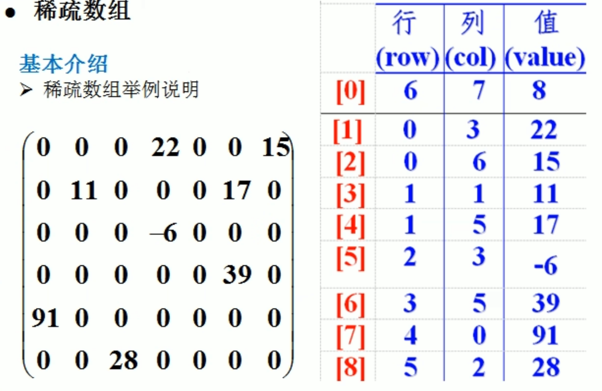

### 概述

#### 1.数据结构与算法的关系

>数据data结构（structure）是一门研究组织数据方式的学科，有了编程语言也就有了数据结构.学好数据结构可以编写出更加漂亮，更加有效率的代码。要学习好数据结构就要多多考虑如何将生活中遇到的问题，用程序去实现解决.程序 =数据结构＋算法数据结构是算法的基础，换言之，想要学好算法，需要把数据结构学到位。

### 数据结构

#### 1.(非)线性结构

> 线性结构作为最常用的数据结构，其特点是数据元素之间存在一对一的线性关系
>
> 线性结构有两种不同的存储结构，即顺序存储结构和链式存储结构。顺序存储的线性表称为顺序表，顺序表中的存储元素是内存地址是连续的
> 链式存储的线性表称为链表，链表中的存储元素不一定是连续的，元素节点中存放数据元素以及相邻元素的地址信息
> 线性结构常见的有：数组、队列、链表和栈，后面我们会详细讲解.
>
> 非线性结构包括：二维数组，多维数组，广义表，树结构，图结构 

#### 2.稀疏数组

> 当一个数组中大部分元素为0，或者为同一个值的数组时，可以使用稀疏数组来保存该数组。
>
> 稀疏数组的处理方法是：
> 1）记录数组一共有几行几列，有多少个不同的值
> 2）把具有不同值的元素的行列及值记录在一个小规模的数组中，从而缩小程序的规模
>
> 
>
> ---
>
> 

#####  2.1 代码实现

```java
package top.mshare.sparsearray;

public class SparseArray {
    public static void main(String[] args) {
        /*
         * 1. 创建一个[11][11]二维数组,0代表无子,1代表黑子,2代表蓝子
         * 2. 第2行第3列是黑子,第3行第4列是蓝子
         * 3. 输入原始二维数组
         * */

        int[][] chessArray = new int[11][11];
        chessArray[1][2] = 1;
        chessArray[2][3] = 2;

        System.out.println("原始数组:");
        for (int[] rows : chessArray) {
            for (int data : rows) {
                System.out.print(data+"  ");
            }
            System.out.println(" ");
        }

        /**
         *  1.将二维数组变成稀疏数组
         *  2.遍历二维数组,获取有效数据(非0数据)个数
         */
        int sum = 0; // 有效数据个数
        for (int[] rows : chessArray) {
            for (int data : rows) {
                if (data != 0) {
                    sum += 1;
                }
            }
        }

        // 创建稀疏数组
        int[][] sparseArr = new int[sum + 1][3];
        // 给稀疏数组赋值
        sparseArr[0][0] = chessArray.length;
        sparseArr[0][1] = chessArray[0].length;
        sparseArr[0][2] = sum;
        int count = 0;
        for (int i = 0; i < chessArray.length; i++) {
            for (int j = 0; j < chessArray[i].length; j++) {
                if (chessArray[i][j] != 0) {
                    // 从第二行开始,给稀疏数数组每一行行赋值
                    count += 1;
                    sparseArr[count][0] = i;
                    sparseArr[count][1] = j;
                    sparseArr[count][2] = chessArray[i][j];
                }
            }
        }

        System.out.println("\n"+"稀疏数组:");
        for (int[] rows : sparseArr) {
            for (int data : rows) {
                System.out.print(data + " | ");
            }
            System.out.println(" ");
        }

        /*
         *  将稀疏数组转换成原始二维数组
         * */
        int totalRow = sparseArr[0][0];
        int totalCol = sparseArr[0][1];
        int[][] originalArray = new int[totalRow][totalCol];

        for (int i = 1; i < sparseArr.length; i++) {
            int row = 0;
            int col = 0;
            int data = 0;
            for (int j = 0; j < sparseArr[i].length; j++) {
                if (j == 0) {
                    row = sparseArr[i][j];
                }
                if (j == 1) {
                    col = sparseArr[i][j];
                }
                data = sparseArr[i][j];
            }
            originalArray[row][col] = data;
        }

        System.out.println("\n"+"从稀疏数组从恢复成原始数组:");
        for (int[] ints : originalArray) {
            for (int anInt : ints) {
                System.out.print(anInt+" ");
            }
            System.out.println(" ");
        }
    }
}
```

#### 3.队列

