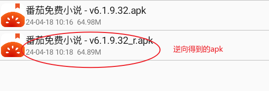
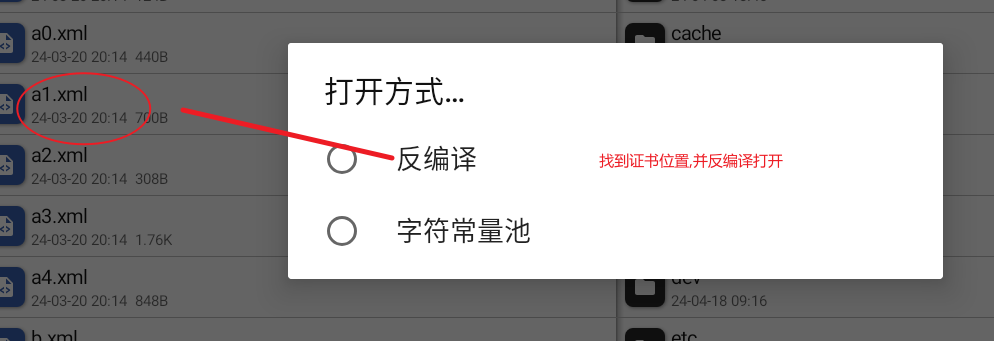

## 1.scrapy

### scrapy的安装

```cmd
# windows
pip install wheel
pip install Twisted
pip install pywin32
pip install scrapy
# 终端输入 scrapy 无报错表示安装成功

#---------------------------------

# ubuntu
sudo apt-get update

sudo apt-get install python-pip python-lxml python-crypto python-cssselect python-openssl python-w3lib python-twisted python-dev libxml2-dev libxslt1-dev zlib1g-dev libffi-dev libssl-dev

sudo pip install scrapy

#---------------------------------

# centOS
sudo yum update
sudo yum -y install libxslt-devel pyOpenSSL python-lxml python-devel gcc
sudo easy_install scrapy
```


### 快速开始

#### 创建工程

`scrapy startproject projectName`


#### 创建爬虫

```cmd
cd scrapyDemo
scrapy genspider example example.com
```


#### 执行爬虫程序

+ > 项目目录下 执行  ：
  >
  > `scrapy crawl example`   
  >
  > 取消日志显示 ：
  >
  > `scrapy crawl exampl --nolog`

+ > 利用python程序执行scrapy脚本
  >
  > ```python
  > from scrapy.cmdline import execute
  > 
  > def main():
  >     execute(['scrapy', 'crawl', 'example'])
  >     
  > if __name__ == "__main__":
  >     main()
  > ```

#### setting.py初始化配置

```python
# 关闭君子协议
ROBOTSTXT_OBEY = False

# 设置user-agent
from fake_useragent import UserAgent

USER_AGENT = UserAgent().random

# 设置日志显示级别
LOG_LEVEL = "ERROR"

# 保存csv文件 出现这种情况 瀵掑啲瀹濈彔鎶勮鎴愬姛 鐖嗗彂浼ゅ 40涓?寮€蹇冧竴涓?
FEED_EXPORT_ENCODING = 'gb18030'

# 保存json和txt文件，出现这种东西不是乱码，是unicode
# FEED_EXPORT_ENCODING = 'utf-8'
```

#### 数据解析

```python
def parse(self, response):
    # response.xpath()返回的是一个Selector对象
    list_title_ele = response.xpath("//header/h2/a/text()")
    # response.xpath().extract_first() 返回第一个Selector对象里面的data数据
    first_title = response.xpath("//header/h2/a/text()").extract_first()
    # response.xpath().extract_first() 返回所有Selector对象里面的data数据集合
    list_title = response.xpath("//header/h2/a/text()").extract()
    print(list_title_ele)
    print(first_title)
    print(list_title)
```

#### 持久化存储

+ ##### 基于终端指令的持久化存储

  > 此方式只能将parse方法的返回值存储到本地文本文件中
  >
  > 保存的文件格式只能是：
  >
  > `('json', 'jsonlines', 'jsonl', 'jl', 'csv', 'xml', 'marshal', 'pickle')`
  >
  > ---
  >
  > ```python
  > list_title = response.xpath("//header/h2/a/text()").extract()
  > list_href = response.xpath("//header/h2/a/@href").extract()
  > return dict(zip(list_title, list_href))
  > ```
  >
  > 执行终端指令：`scrapy crawl example -o ./temp.json`

+ ##### 基于管道持久化存储

  > 1. 数据解析
  >
  >    > ```python
  >    > list_title = response.xpath("//header/h2/a/text()").extract()
  >    > list_href = response.xpath("//header/h2/a/@href").extract()
  >    > ```
  >
  > 2. 在item.py中定义与解析数据相关的属性
  >
  >    > ```python
  >    > class ScrapydemoItem(scrapy.Item):
  >    >     title = scrapy.Field()
  >    >     href = scrapy.Field()
  >    > ```
  >
  > 3. 在爬虫文件(xxxSpider.py)中将item对象封装后交给管道(pipelines)进行持久化存储
  >
  >    > ```python
  >    > item = ScrapydemoItem()
  >    > for i in range(len(list_title)):
  >    >     item["title"] = list_title[i]
  >    >     item["href"] = list_href[i]
  >    >     yield item
  >    > ```
  >
  > 4. 在管道类process_item方法中处理、存储接受的item对象
  >
  >    > ```python
  >    > class ScrapydemoPipeline:
  >    >     # 重写父类方法,只会在启动程序时执行一次
  >    >     def open_spider(self, spider):
  >    >         self.f = open("./temp.txt", "w", encoding="utf-8")
  >    >         print("start")
  >    > 
  >    >     # 重写父类方法,只会在结束程序时执行一次
  >    >     def close_spider(self, spider):
  >    >         self.f.close()
  >    >         print("end")
  >    > 
  >    >     # (example.py),yield一次数据,就会自动调用process_item(xxx)方法
  >    >     def process_item(self, item, spider):
  >    >         self.f.write("{}:{}\n".format(item["title"], item["href"]))
  >    >        # 一般情况下要将item返回，目的是将item封装的数据交给下一个处理的管道类对象
  >    >         return item
  >    > ```
  >
  > 5. 在配置文件中开启管道类相关配置
  >
  >    > ```python
  >    > ITEM_PIPELINES = {
  >    >     # 数值(300)越小,优先级越高
  >    >    'scrapyDemo.pipelines.ScrapydemoPipeline': 300,
  >    > }
  >    > ```

- ##### 需求: 一份数据多种保存方式

  > 1. 配置文件中开启多个管道，数值越小优先级越高
  >
  >    > ```python
  >    > ITEM_PIPELINES = {
  >    >     'scrapyDemo.pipelines.ScrapydemoPipeline': 300,
  >    >     'scrapyDemo.pipelines.MysqlDemoPipeline': 400,
  >    > }
  >    > ```
  >
  > 2. 在pipeline.py文件中创建MysqlDemoPipeline类对象 使用mysql保存数据
  >
  >    > ```python
  >    > class MysqlDemoPipeline(object):
  >    >     def open_spider(self, spider):
  >    >         import pymysql
  >    > 
  >    >         self.conn = pymysql.Connect(
  >    >             host='127.0.0.1',
  >    >             port=3306,
  >    >             user='root',
  >    >             passwd='root',
  >    >             db='python_test',
  >    >             charset='utf8')
  >    > 
  >    >         self.cursor = self.conn.cursor()
  >    > 
  >    >     def close_spider(self, spider):
  >    >         self.cursor.close()
  >    >         self.conn.close()
  >    > 
  >    >     def process_item(self, item, spider):
  >    >         import uuid
  >    >         sql = "insert into test1(id,title,href)values('{}','{}','{}')".format(str(uuid.uuid1()), item["title"],item["href"])
  >    >         try:
  >    >             self.cursor.execute(sql)
  >    >             self.conn.commit()
  >    >         except Exception as e:
  >    >             print(e)
  >    >             self.conn.rollback()
  >    >         # 一般情况下要将item返回，目的是将item封装的数据交给下一个处理的管道类对象
  >    >         return item
  >    > ```

### 五大核心组件

- 

- > __scrapy Engine__: 用来处理整个系统的数据流处理, 触发事务(框架核心)
  >
  > 
  >
  > __Scheduler__: 用来接受引擎发过来的请求, 压入队列中, 并在引擎再次请求的时候返回. 可以想像成一个URL的优先队列, 由它来决定下一个要抓取的网址是什么, 同时去除重复的网址
  >
  > 
  >
  > __Spider__:  主要用来干活的，用于从特定页面提取所需信息，也可以提取url传递到scrapyEngine继续爬取
  >
  > 
  >
  > __Pipeline__: 负责处理爬虫从网页中抽取的实体，主要的功能是持久化实体、验证实体的有效性、清除不需要的信息。当页面被爬虫解析后，将被发送到项目管道，并经过几个特定的次序处理数据
  >
  > 
  >
  > __Downloader Middlewares__: 位于Scrapy引擎和下载器之间的中间件，主要是处理ScrapyEnginedownloader之间的请求及响应
  >
  > 
  >
  > __Spider Middlewares__: 介于ScrapyEngine和Spider之间的中间件，主要工作是处理响应输入和请求输出

#### 请求传参

- 所需要的请求的数据不在同一个页面，所以将部分解析的数据封装完成后传递到下一次请求当中

  > ```python
  > class TransferArgumentsSpider(scrapy.Spider):
  >     name = 'transferArguments'
  >     # start_urls = ['http://www.ypojie.com/page/2']
  >     start_urls = ['http://www.ypojie.com/page/{}'.format(i) for i in range(2, 10)]
  > 
  >     def parse(self, response):
  >         list_title = response.xpath("//header/h2/a/text()").extract()
  >         list_href = response.xpath("//header/h2/a/@href").extract()
  >         item = ScrapydemoItem()
  >         for i in range(len(list_title)):
  >             item["title"] = list_title[i]
  > 
  >             # meta 可以将封装的数据传递给下一次请求(callback对应的函数)返回的响应对象中 response.meta
  >             yield scrapy.Request(list_href[i], callback=self.parse_detail, meta={"item": item})
  > 
  >     def parse_detail(self, response):
  >         item = response.meta['item']
  >         # xpath表达式 可以通过 string(...)提取整个标签下(包含子标签)所有文本,不需要加/text()指定提取文本
  >         item["article"] = response.xpath("string(//article/p[1])").extract_first()
  >         yield item
  > ```
  >
  > 

#### 图片下载

> __注意：使用scrapy中的ImagesPIpeline批量下载图片时先安装如下库，否则相应的pipeline无法获取数据__
>
> ```python
> pip install pillow
> pip install image
> ```

> 1. 编写item.py
>
>    > ```python
>    > class ImageItem(scrapy.Item):
>    >     title = scrapy.Field()
>    >     src = scrapy.Field()
>    > ```
>
> 2. 编写Spider
>
>    > ```python
>    > class DownloadImageSpider(scrapy.Spider):
>    >     name = 'downloadImage'
>    >     start_urls = ['http://pic.netbian.com/4kmeinv/index.html']
>    > 
>    >     def parse(self, response):
>    >         list_img_detail = response.xpath("//ul[@class='clearfix']//a/@href").extract()
>    >         list_img_name = response.xpath("//ul[@class='clearfix']//b/text()").extract()
>    > 
>    >         next_page_url = response.xpath("//div[@class='page']//a[last()]/@href").extract_first()
>    > 
>    >         for i in range(len(list_img_name)):
>    >             """
>    >            list_img_detail[0]=/tupian/30600.html
>    >             http://pic.netbian.com/tupian/30600.html
>    >             """
>    >             item = ImageItem()
>    >             item["title"] = list_img_name[i]
>    >             url = "http://pic.netbian.com{}".format(list_img_detail[i])
>    >             yield scrapy.Request(url, callback=self.parse_detail, meta={"item": item})
>    > 
>    >         if next_page_url is not None:
>    >             url = "http://pic.netbian.com{}".format(next_page_url)
>    >             yield scrapy.Request(url, callback=self.parse)
>    > 
>    >     def parse_detail(self, response):
>    >         item = response.meta["item"]
>    >         img_src = response.xpath("//div[@class='photo-pic']//img/@src").extract_first()
>    >         """
>    >         img_src=/uploads/allimg/221126/004100-1669394460ffcd.jpg
>    >         http://pic.netbian.com/uploads/allimg/221126/004100-1669394460ffcd.jpg
>    >         """
>    > 
>    >         item["src"] = "http://pic.netbian.com{}".format(img_src)
>    >         yield item
>    > ```
>
> 3. 编写pipeline.py
>
>    > ```python
>    > import scrapy
>    > from scrapy.pipelines.images import ImagesPipeline
>    > 
>    > 
>    > class DownloadImagePipeline(ImagesPipeline):
>    > 
>    >     # 利用item里面的src属性发送请求
>    >     def get_media_requests(self, item, info):
>    >         # 可以自定义meta数据  将所需要的图片名称信息传递给 def file_path(xx)
>    >         yield scrapy.Request(item["src"], meta={"item": item})
>    > 
>    >     # 设置图片文件名
>    >     def file_path(self, request, response=None, info=None, *, item=None):
>    >         # 可以通过request.meta 拿到上面传递的meta数据信息
>    >         title = request.meta["item"]["title"].replace(" ", "")
>    >         extend_name = request.url.split(".")[-1]
>    >         filename = title + "." + extend_name
>    >         print("{}下载完成".format(filename))
>    >         # 必须返回文件名
>    >         return filename
>    > 
>    >     #
>    >     def item_completed(self, results, item, info):
>    >         # return item # 将图片对象交给下一个pipeline 无特殊情况不需要这样做
>    >         pass
>    > ```
>
> 4. 编写settings.ps
>
>    > ```python
>    > BOT_NAME = 'scrapyDemo'
>    > 
>    > SPIDER_MODULES = ['scrapyDemo.spiders']
>    > NEWSPIDER_MODULE = 'scrapyDemo.spiders'
>    > ITEM_PIPELINES = {
>    >     # 'scrapyDemo.pipelines.ScrapydemoPipeline': 300,
>    >     # 'scrapyDemo.pipelines.MysqlDemoPipeline': 400,
>    >     # 'scrapyDemo.pipelines.TransferArgumentsPipeline': 500,
>    >     # 'scrapyDemo.pipelines.TestPipeline': 600,
>    >     'scrapyDemo.pipelines.DownloadImagePipeline': 100,
>    > }
>    > 
>    > # 关闭君子协议
>    > ROBOTSTXT_OBEY = False
>    > 
>    > # 设置user-agent
>    > from fake_useragent import UserAgent
>    > 
>    > USER_AGENT = UserAgent().random
>    > 
>    > # 设置日志显示级别
>    > LOG_LEVEL = "ERROR"
>    > 
>    > # 设置请求并发数量
>    > CONCURRENT_REQUESTS = 16
>    > 
>    > # 设置延迟下载时间
>    > DOWNLOAD_DELAY = 1
>    > 
>    > # 使用ImagePipeline时设置图片的保存目录
>    > IMAGES_STORE = './imgs'
>    > ```


> + __可以使用wget库下载图片__
>
> > ```python
> > import wget
> > 
> > url = "https://pic.netbian.com/uploads/allimg/220430/002435-16512494757fe7.jpg"
> > wget.download(url, out="./temp.jpg")
> > ```
>
> + __response.body也可以获取二级制文件__
>
> > ```python
> > class MiddlewaresdemoSpider(scrapy.Spider):
> >     name = 'middlewaresDemo'
> >     start_urls = ['https://pic.netbian.com/uploads/allimg/220430/002435-16512494757fe7.jpg']
> > 
> >     def parse(self, response):
> >         with open("./a.jpg", "wb")as f:
> >             f.write(response.body)
> > ```
> >
> > 

#### 下载中间件

> __downloadMiddlewa__: 位于引擎和下载器之间，可以批量拦截请求和响应，可以作用于ua伪装、ip代理、篡改响应对象、数据
>
> > 在settings.py文件中配置中间件
> >
> > ```python
> > DOWNLOADER_MIDDLEWARES = {
> >    'scrapyDemo.middlewares.ScrapydemoDownloaderMiddleware': 543,
> > }
> > ```
>
> > 下载中间件位于middlewa.py
> >
> > ```python
> > class ScrapydemoDownloaderMiddleware:
> > 
> >     def process_request(self, request, spider):
> >         return None
> > 
> >     def process_response(self, request, response, spider):
> >         return response
> > 
> >     def process_exception(self, request, exception, spider):
> >         pass
> > ```
>
> - 拦截请求
>
>   > ```python
>   > # 拦截请求对象 return None表示请求继续执行
>   > def process_request(self, request, spider):
>   >     # 每次请求随机更换ua,增加隐匿性
>   >     ua = UserAgent().random
>   >     request.headers["user-agent"] = "hxh"
>   >     return None
>   > ```
>
> - 更换代理IP
>
>   > ```python
>   > # 请求异常无法处理时进去该方法
>   > def process_exception(self, request, exception, spider):
>   >     # 请求异常时更换ip代理
>   >     protocol_name = request.url.split(":")[0]
>   >     if protocol_name == "http":
>   >         request.meta["proxy"] = "http://ip:port"
>   >     else:
>   >         request.meta["proxy"] = "https://ip:port"
>   > 
>   >         # 更换异常请求对象的ip,然后返回继续执行
>   >     return request
>   > ```
>
> - 修改响应内容
>
>   > ```python
>   > from scrapy.http import HtmlResponse
>   > def process_response(self, request, response, spider):
>   >  # 修改响应内容,避免乱码
>   >  response = HtmlResponse(url=response.url, body=response.body, encoding='utf-8')
>   >  return response
>   > ```
>   
> - 使用selenium加载动态内容
>
>   > 1. 创建 模拟浏览器对象spider.brower
>   >
>   >    > ```python
>   >    > from selenium import webdriver
>   >    > 
>   >    > firefox_options = webdriver.FirefoxOptions()
>   >    > firefox_options.add_argument("--headless")
>   >    > firefox_options.add_argument("--disable-gpu")
>   >    > 
>   >    > 
>   >    > class ScrapyseleniumPipeline:
>   >    >  # spider 就是自定义爬虫类的实例化对象
>   >    >     def open_spider(self, spider):
>   >    >         spider.brower = webdriver.Firefox(executable_path="./geckodriver.exe", options=firefox_options)
>   >    > 
>   >    >     def close_spider(self, spider):
>   >    >         spider.brower.close()
>   >    > 
>   >    >     def process_item(self, item, spider):
>   >    >         return item
>   >    > ```
>   >
>   > 2. 下载中间件利用spider传递过来的浏览器对象发送请求，构造新的响应对象
>   >
>   >    > ```python
>   >    > def process_response(self, request, response, spider):
>   >    >     brower = spider.brower
>   >    >     brower.get(request.url)
>   >    >     resp = brower.page_source
>   >    > 
>   >    >     return HtmlResponse(url=request.url, body=resp, encoding="utf-8", request=request)
>   >    > ```


#### 增量式爬虫

> 增量式爬虫
>
> - 概念：监测网站数据更新的情况，只会爬取网站最新更新出来的数据。
>   -分析：
>
> - 指定一个起始url
>
> - 基于CrawlSpider获取其他页码链接
>
> - 基于Ruler 将其他页码链接进行请求
>
> - 从每一个页码对应的页面源码中解析出每一个电影详情页的URL
>
> - 核心：检测电影详情页的url之前有没有请求过
>
>   ​	将爬取过的电影详情页的url存储
>
>   ​	存储到redis的set数据结构
>
> - 对详情页的url发起请求，然后解析出电影的名称和简介
>
> - 进行持久化存储

```python
# ......
def parse(self, response):
    # sadd()==0 代表这个URL已经被爬取过
    if self.conn.sadd("urls", response.url) == 0:
        return
# ......
```


---


## 2.tip

#### 1.selenium

##### 1.1 基本使用

> - 模拟浏览器发送请求
>
>   > ```python
>   > from selenium import webdriver
>   > 
>   > # executable_path浏览器驱动位置
>   > # 创建浏览器对象
>   > brower = webdriver.Firefox(executable_path="./geckodriver.exe")
>   > # 模拟浏览器发送请求
>   > brower.get("http://www.baidu.com")
>   > # 获取网页源代码
>   > brower.page_source
>   > # 关闭浏览器对象,释放资源
>   > borwer.close()
>   > ```
>
> - 元素定位
>
>   > ```python
>   > from selenium.webdriver.common.by import By
>   > from selenium import webdriver
>   > 
>   > brower = webdriver.Firefox(executable_path="./geckodriver.exe")
>   > # 通过元素id定位
>   > e1=brower.find_element(By.ID, "元素id")
>   > # e1执行点击事件
>   > e1.click()
>   > # 通过xpath表达式定位元素
>   > e2=brower.find_element(By.XPATH,"xpath表达式")
>   > # 给输入框填写文本
>   > e.send_keys("文本内容")
>   > 
>   > # 查找元素的方式有如下几种:
>   > """
>   > Set of supported locator strategies.
>   > 
>   > find_element(By.ID | By.NAME |By.CLASS_NAME ......
>   > 
>   > ID = "id"
>   > XPATH = "xpath"
>   > LINK_TEXT = "link text"
>   > PARTIAL_LINK_TEXT = "partial link text"
>   > NAME = "name"
>   > TAG_NAME = "tag name"
>   > CLASS_NAME = "class name"
>   > CSS_SELECTOR = "css selector"
>   > """
>   > ```


---


##### 1.2 无头模式

> ```python
> def get_browser(browser_path: str = "./chromedriver", header: bool = False, detection=False):
>  """
> 
>  :param browser_path: 浏览器驱动路径
>  :param header: False 表示创建无头浏览器
>  :param detection: False 表示规避检测
>  :return: 浏览器对象
>  """
>  from selenium import webdriver
>  from selenium.webdriver.chrome.service import Service
>  from selenium.webdriver.chrome.options import Options  # 实现无头浏览器必须导入的类
> 
>  from selenium.webdriver.support.ui import WebDriverWait  # 设置全局等待时间
>  from selenium.webdriver.support import expected_conditions as EC
>  from selenium.webdriver.common.by import By  # xpath定位元素
> 
>  chrome_options = Options()
> 
>  # 添加代理
>  chrome_options.add_argument(f"--proxy-server=http://127.0.0.1:1087")
>  
>  # 以debug模式启动本地浏览器,chrome 是浏览器可执行程序文件,定位到chrome的位置,进入相关目录执行
>  # chrome --remote-debugging-port=9222
>  # 这种模式下调试 使用无头模式是冲突的
>  # 使用调试模式打开浏览器 避免后端检测selenium
>  chrome_options.add_argument("--disable-extensions")  #禁用扩展
>  chrome_options.add_experimental_option("debuggerAddress", "127.0.0.1:9222") #连接到调试模式下的浏览器
> 
>  if not header:
>      # 创建无头浏览器需要设置的参数
>      chrome_options.add_argument("--headless")
>      chrome_options.add_argument("--disable-gpu")
> 
>  if not detection:
>      # 规避浏览器对selenium的检测 (去掉左上角显示的被自动化软件操作的提示)
>      chrome_options.add_experimental_option('excludeSwitches', ['enable-automation'])
> 
>  # 创建全局浏览器对象
>  service = Service(browser_path)
>  browser = webdriver.Chrome(service=service, options=chrome_options)
> 
>  # 设置全局等待时长为5s
>  wait = WebDriverWait(browser, 5)
> 
>  """
>  # 示例代码
>  browser.get("https://www.baidu.com")
>  try:
>      # 浏览器等待,直到XPATH匹配到这个元素才执行下面的动作
>      # 因为设置了全局等待时长,如果超过5s还没有出现XPATH匹配的元素,则报错
>      wait.until(EC.presence_of_element_located((By.ID, "su")))
>      wait.until(EC.presence_of_element_located((By.ID, "kw")))
> 
>      search_btn = browser.find_element(By.ID, "su")
>      search_input = browser.find_element(By.ID, "kw")
>      search_input.send_keys("海贼王")
>      # 模拟点击按钮
>      search_btn.click()
>      time.sleep(3)
> 
>      # selenium 执行JS代码,X方向不动,Y方向向下滚动到低
>      browser.execute_script("window.scrollTo(0,document.body.scrollHeight)")
> 
>      time.sleep(3)
>      print(browser.page_source)
> 
>  except Exception as e:
>      print(e)
>  """
>  return browser, wait
> ```


##### 1.3 等待方式

> - 强制等待
>
>   > ```python
>   > # 设置多少秒页面就会等待多少秒,这个方法很容易让线程挂掉，使程序抛异常，所以要慎用此方法
>   > import time
>   > time.sleep(3)
>   > ```
>
> - 隐式等待
>
>   > ```python
>   > """
>   > 一次设置，全局生效。不要当作固定等待使用，不要每次需要等待时都写一次隐式等待
>   > 隐式等待设置了一个最长等待时间，在规定时间内网页加载完成(也就是一般情况下你看到浏览器标签栏那个小圈不再转就代表加载完成)，则执行下一步，否则一直等到时间结束，然后执行下一步
>   > """
>   > from selenium import webdriver
>   > from selenium.webdriver.common.by import By
>   > 
>   > brower = webdriver.Firefox(executable_path="./geckodriver.exe")
>   > 
>   > # 开启隐式等待  全局设置
>   > brower.implicitly_wait(10)
>   > 
>   > brower.get("https://www.github.com")
>   > brower.find_element(By.XPATH,"//div")
>   > ```
>
> - 显示等待
>
>   > ```python
>   > """
>   > 当等待的条件满足后（一般用来判断需要等待的元素是否加载出来），就继续下一步操作。等不到就一直等，如果在规定的时间之内都没找到，那么就跳出Exception。
>   > 
>   > 使用显示等待前需先导入显示等待所需模块和等待条件
>   > """
>   > 
>   > 
>   > from selenium import webdriver
>   > from selenium.webdriver.common.by import By
>   > 
>   > # 显式等待模块
>   > from selenium.webdriver.support.ui import WebDriverWait
>   > # 显式等待条件
>   > from selenium.webdriver.support import expected_conditions as ec
>   > 
>   > brower = webdriver.Firefox(executable_path="./geckodriver.exe")
>   > 
>   > 
>   > """
>   > 元素是否存在判断条件如下:
>   > title_is(str)  str是期望匹配标题
>   > title_contains(str)  str是期望元素包含某些内容
>   > presence_of_element_located  判断期待元素是否存在
>   > ...... url_matches
>   > """
>   > 
>   > """
>   > 10是最长等待时间，0.5是每0.5秒去查询对应的元素
>   > until后面跟的等待具体条件，EC是判断条件，检查元素是否存在于页面的 DOM上
>   > """
>   > login_btn = WebDriverWait(brower, 10, 0.5).until(ec.presence_of_element_located((By.ID, "s-top-loginbtn")))
>   > 
>   > if login_btn is not None:
>   >     login_btn.click()
>   > ```


##### 1.4 爬虫暂停与重启机制

```bash
# 创建多级目录 jsobinfo/001,所有的爬虫文件信息存放到 jboinfo目录下,不同的爬虫在这个job目录下创建不同的文件夹区分
# 如 1号爬虫 jobinfo/001  2号爬虫 jobinfo/002 ......
# 在命令行运行下面这个指令  (不要在 ide 的终端执行,因为scrapy信号处理机制不同)
scrapy crawl demo -s JODDIR=./jobinfo/001

# 在终端按一次  ctrl+c  可以暂停爬虫,爬虫的相关信息 保存到了 ./jobinfo/001

# 下次重新爬虫再次输入
scrapy crawl demo -s JODDIR=./jobinfo/001
```


#### 2.虚拟环境

```bash
pip install virtualenv

# 在当前目录创建虚拟环境
virtualenv demo

# 激活虚拟环境
# linux mac
cd demo/bin
source activate
# win
cd demo/Scripts
activate.bat

# 退出虚拟环境
# linux mac
deactivate
# win
deactivate.bat
```


#### 3.pyenv

```bash
# 查看所有的远程的python版本
pyenv install --list 

# 查看所有本地的安装的python版本
pyenv versions

# 安装指定版本python
pyenv install 3.10.0
# 卸载制定版本
pyenv uninstall 3.10.0

# 设置全局python的版本
pyenv global 3.10.0

# 查看当前版本
python -V
```


#### 4.settings.py解释

```python
USER_AGENT = "全局UA设置"

ROBOTSTXT_OBEY = False

# 只要取消注释,就相当于 COOKIES_ENABLED = True
# cookies的值默认从 DEFAULT_REQUEST_HEADERS 的配置找
# 禁用 Scrapy 的 cookies 处理。每个请求都不会携带或接收 cookies，视为独立无关的会话
# 可以在单个 Request 对象中手动设置 cookies，适用于需要为特定请求定制 cookies 的场景
COOKIES_ENABLED = False
# 启用 cookies 后，Scrapy 将自动处理 cookies，可以在请求之间保持状态，如登录信息、会话标识等
# COOKIES_ENABLED = True

# 设置请求并发数量,默认16
# CONCURRENT_REQUESTS = 32

# 下载延迟
# DOWNLOAD_DELAY = 3

# 设置日志显示级别
# LOG_LEVEL = "INFO"

# 下载中间件
# "项目名.middlewares.类名":优先级,   数字越小优先级越高 ,取值范围 1-1000
# DOWNLOADER_MIDDLEWARES = {
#    "scrapyDemo5.middlewares.Scrapydemo5DownloaderMiddleware": 543,
# }

# redis配置
# 4.指定redis数据库的地址
# REDIS_URL = 'redis://192.168.10.150:6379'

# REDIS_HOST = "192.168.10.150"
# REDIS_PORT = 6379
# REDIS_ENCODING = 'utf-8'
# REDIS_PARAMS = {"password":"123456"}

# mysql配置
# MYSQL_INFO = {
#     "HOST": "192.168.10.150",
#     "USERNAME": "root",
#     "PWD": "root",
#     "DB": "python_sdpier",
#     "CHARSET": "utf-8"
# }

# 图片下载配置
ITEM_PIPELINES = {
   "scrapyDemo3.pipelines.ImgPipeline": 300,
}
# 使用ImagePipeline时设置图片的保存目录
IMAGES_STORE = './imgs'

```


#### 5.数据异步入库

```python
import time

from MySQLdb import connect
from twisted.enterprise import adbapi


# 同步保存数据,拖慢爬虫整体的速度
class Scrapydemo2Pipeline:
    def __init__(self):
        self.conn = connect(host="192.168.10.150", user="root", password="root", db="python_spider",
                            port=3306,
                            charset="utf8", use_unicode=True)
        self.cursor = self.conn.cursor()

    def process_item(self, item, spider):
        sql = """
            insert into music_info(title,author,real_href) values (%s,%s,%s)
            """
        self.cursor.execute(sql, (f"测试标题{time.time()}", "测试数据", "测试数据"))
        self.conn.commit()
        return item


# 异步保存数据
class TwistedSaveDate:
    # 方法名固定,scrapy会自动将settings.py的配置属性注入到方法的settings变量中
    @classmethod
    def from_settings(cls, settings):
        # from MySQLdb.cursors import DictCursor
        dbParam = dict(
            host=settings["MYSQL_HOST"],
            db=settings["MYSQL_DB"],
            user=settings["MYSQL_USER"],
            passwd=settings["MYSQL_PWD"],
            port=settings["MYSQL_PORT"],
            charset="utf8",
            # cursorClass=DictCursor,
            use_unicode=True
        )

        pool = adbapi.ConnectionPool("MySQLdb", **dbParam)
        return cls(pool)

    def __init__(self, pool):
        self.pool = pool

    def process_item(self, item, spider):
        # 异步存入数据
        result = self.pool.runInteraction(self.insert_data, item)
        # 异步插入数据出错执行的回调方法
        result.addErrback(self.handle_error, item, spider)
        pass

    # cursor 会自动注入
    def insert_data(self, cursor, item):
        sql = """insert into music_info(title,author,real_href) values (%s,%s,%s)"""
        cursor.execute(sql, (f"测试标题{time.time()}", "测试数据", "测试数据"))
        pass

    def handle_error(self, failure, item, spider):
        print(failure)
```


#### 6.使用cookies

```python
import time
import pickle
import requests
from selenium import webdriver
from selenium.webdriver.chrome.service import Service
from selenium.webdriver.chrome.options import Options  # 实现无头浏览器必须导入的类

from selenium.webdriver.support.ui import WebDriverWait  # 设置全局等待时间
from selenium.webdriver.support import expected_conditions as EC
from selenium.webdriver.common.by import By  # xpath定位元素


def get_browser(browser_path: str = "./chromedriver", header: bool = False, detection=False):
    """

    :param browser_path: 浏览器驱动路径
    :param header: False 表示创建无头浏览器
    :param detection: False 表示规避检测
    :return: 浏览器对象
    """

    chrome_options = Options()
    if not header:
        # 创建无头浏览器需要设置的参数
        chrome_options.add_argument("--headless")
        chrome_options.add_argument("--disable-gpu")

    if not detection:
        # 规避浏览器对selenium的检测 (去掉左上角显示的被自动化软件操作的提示)
        chrome_options.add_experimental_option('excludeSwitches', ['enable-automation'])

    # 创建全局浏览器对象
    service = Service(browser_path)
    browser = webdriver.Chrome(service=service, options=chrome_options)

    # 设置全局等待时长为5s
    wait = WebDriverWait(browser, 5)

    """
    # 示例代码
    browser.get("https://www.baidu.com")
    try:
        # 浏览器等待,直到XPATH匹配到这个元素才执行下面的动作
        # 因为设置了全局等待时长,如果超过5s还没有出现XPATH匹配的元素,则报错
        wait.until(EC.presence_of_element_located((By.ID, "su")))
        wait.until(EC.presence_of_element_located((By.ID, "kw")))

        search_btn = browser.find_element(By.ID, "su")
        search_input = browser.find_element(By.ID, "kw")
        search_input.send_keys("海贼王")
        # 模拟点击按钮
        search_btn.click()
        time.sleep(3)

        # selenium 执行JS代码,X方向不动,Y方向向下滚动到低
        browser.execute_script("window.scrollTo(0,document.body.scrollHeight)")

        time.sleep(3)
        print(browser.page_source)

    except Exception as e:
        print(e)
    """
    return browser, wait


def get_cookies(browser):
    browser.get("https://www.51zxw.net/login")
    browser.find_element(By.ID, "loginStr").send_keys("xxxxxx")
    browser.find_element(By.ID, "pwd").send_keys("xxxxxx")
    browser.find_element(By.XPATH, '//button[@type="submit"]').click()
    time.sleep(2)
    cookies = browser.get_cookies()

    # 将cookies 列表对象写入(pickle.dump()实现数据序列化)文件中
    pickle.dump(cookies, open("./test.cookie", "wb"))


def use_cookie():
    cookies = pickle.load(open("./test.cookie", "rb"))

    # 将cookies列表对象转成字典对象
    cookies_dict = dict()
    for cookie in cookies:
        cookies_dict[cookie['name']] = cookie['value']

    headers = {
        "user-agent": "Mozilla/5.0 (Macintosh; Intel Mac OS X 10_15_7) AppleWebKit/537.36 (KHTML, like Gecko) Chrome/123.0.0.0 Safari/537.36"
    }

    # request使用cookies
    resp = requests.get("https://www.51zxw.net/Login/UserCenter", headers=headers, cookies=cookies_dict)
    print(resp.text)

    # scrapy使用cookies, settings.py 设置 COOKIES_ENABLED = True
    # scrapy.Request("https://www.51zxw.net/Login/UserCenter", cookies=cookies)


def main():
    browser1, wait1 = get_browser(browser_path="./chromedriver_V123-0-6312-22")
    get_cookies(browser1)
    browser1.quit()


if __name__ == '__main__':
    main()
```


#### 7. 获取settings属性值

```python
class DemoSpider(RedisSpider):
    name = "demo"
    start_urls = ["https://demo.com"]
    
    # 覆盖 settings.py的属性值
    custom_settings = {
        "USER_AGENT": "xxxx",
        "DOWNLOAD_TIMEOUT":3
    }
    
    def parse(self,response):
        # 获取settings.py的属性值
        self.settings.get("BOT_NAME")
```


---


## 3.抓包

### 3.1 基于fiddler抓包

#### 3.1.1 配置fiddler主机

- 选项设置 tools -> options

- 配置抓取https协议包,安装根证书


- 配置fiddler作为代理服务器的端口


- 配置fiddler作为网关服务,方便抓取局域网内其他主机

  

#### 3.1.2 配置手机代理

- 手机下载 fiddler证书
- 
- 手机安装fiddler证书


- 手机配置fiddler代理服务器信息


#### 3.1.3 注意事项

- 这种配置方式完成后,也只能抓取手机浏览器访问网站的数据包,因为我们安装的这个证书是用户证书,而不是系统证书,一些app使用的是系统证书,所以使用这种方式抓app的数据包有可能造成app崩溃或者断网


- 对包进行app安装包进行逆向解析分析




- 查看逆向的安装包证书信息

  





- 如果在android低版本可以对证书配置信息修改,那就可以直接抓包,如果是Android是高版本不能修改app证书信息,那就会导致抓app包失败

### 3.2 基于lsposed抓包

> 为了抓取app的数据包,需要安装lsposed框架,通过模拟器演示
>
> 假设安卓模拟器已经安装完成了 Magisk 和 Lsposed框架

#### 3.2.1 在Magisk 中刷入MagiskTrustUserCerts.zip

> 成功刷入模块后必须重启模拟器


#### 3.2.2 安装 JustTrustMe.apk 

> 用来绕过 SSL Pinning，并在 LSPosed 中启用，模块作用域指定为 FGO


#### 3.2.3 Reqable抓包工具安装

> 完成上述步骤后,模拟器和主机同时安装 Reqable

- Reqable 安装根证书到本地主机


- Reqable安装根证书到模拟器中

  

- 主机端安装根证书后导出根证书,注意证书到处的证书格式


- 模拟器完成根证书安装后,打开将手机端Reqable ,将的根证书替换成 主机生成的根证书


- 模拟器配置 Reqable信息,方便主机端Reqable抓取模拟器的包


#### 3.2.4 测试

- 勾选只抓取特定的app


- 电脑端查看抓取数据包状态


---


## 4.scrapy-redis

### 4.1 环境准备

```bash
# 创建 redis 数据库
# # 源码下载 :  wget http://download.redis.io/releases/redis-5.0.4.tar.gz
docker run -p 6379:6379 --name redis_5.0.4 -v /data/docker/redis/redis.conf:/etc/redis/redis.conf -v /data/docker/redis/data:/data -d redis:5.0.4-alpine3.9 redis-server /etc/redis/redis.conf --appendonly yes --requirepass "root"
```


### 4.2 分布式爬虫流程

#### 4.2.1 创建虚拟环境

```bash
# 为了避免版本冲突,本次示例使用python版本:  python3.10.0
# pip install virtualenv
virtualenv ~/.virtualenvs/scrapy-redis # 创建虚拟环境

# 激活虚拟环境
# unix
cd ~/.virtualenvs/scrapy-redis/bin
source activate
# win
cd ~/.virtualenvs/scrapy-redis/Scripts
activate.bat

# 退出虚拟环境
# unix
deactivate
# win
deactivate.bat
```


#### 4.2.2 创建scrapy项目

```bash
# 在虚拟环境下安装项目需要的模块
pip install scrapy==2.8.0
pip install scrapy-redis==0.7.3
pip install Twisted==22.10.0  # 这个下载scrapy时可能下载最新版,先卸载最新版本,然后安装此版本

# 在虚拟环境下创建该项目
scrapy startproject demo_scrapy_redis
cd demo_scrapy_redis
scrapy genspider demo demo.com
```


#### 4.2.3 修改配置文件

settings.py

```python
SPIDER_MODULES = ["demo_scrapy_redis.spiders"]
NEWSPIDER_MODULE = "demo_scrapy_redis.spiders"

#CONCURRENT_REQUESTS = 32

#DOWNLOAD_DELAY = 3
#CONCURRENT_REQUESTS_PER_DOMAIN = 16
#CONCURRENT_REQUESTS_PER_IP = 16


#COOKIES_ENABLED = False


#TELNETCONSOLE_ENABLED = False


#DEFAULT_REQUEST_HEADERS = {
#    "Accept": "text/html,application/xhtml+xml,application/xml;q=0.9,*/*;q=0.8",
#    "Accept-Language": "en",
#}

#SPIDER_MIDDLEWARES = {
#    "demo_scrapy_redis.middlewares.DemoScrapyRedisSpiderMiddleware": 543,
#}

#DOWNLOADER_MIDDLEWARES = {
#    "demo_scrapy_redis.middlewares.DemoScrapyRedisDownloaderMiddleware": 543,
#}

#EXTENSIONS = {
#    "scrapy.extensions.telnet.TelnetConsole": None,
#}

#ITEM_PIPELINES = {
#    "demo_scrapy_redis.pipelines.DemoScrapyRedisPipeline": 300,
#}

#AUTOTHROTTLE_ENABLED = True
# The initial download delay
#AUTOTHROTTLE_START_DELAY = 5
# The maximum download delay to be set in case of high latencies
#AUTOTHROTTLE_MAX_DELAY = 60
# The average number of requests Scrapy should be sending in parallel to
# each remote server
#AUTOTHROTTLE_TARGET_CONCURRENCY = 1.0
# Enable showing throttling stats for every response received:
#AUTOTHROTTLE_DEBUG = False

#HTTPCACHE_ENABLED = True
#HTTPCACHE_EXPIRATION_SECS = 0
#HTTPCACHE_DIR = "httpcache"
#HTTPCACHE_IGNORE_HTTP_CODES = []
#HTTPCACHE_STORAGE = "scrapy.extensions.httpcache.FilesystemCacheStorage"

# Set settings whose default value is deprecated to a future-proof value
REQUEST_FINGERPRINTER_IMPLEMENTATION = "2.7"
TWISTED_REACTOR = "twisted.internet.asyncioreactor.AsyncioSelectorReactor"
FEED_EXPORT_ENCODING = "utf-8"

# 关闭君子协议
ROBOTSTXT_OBEY = False

# 设置日志显示级别
LOG_LEVEL = "ERROR"

# 设置全局默认ua
USER_AGENT = "Mozilla/5.0 (Macintosh; Intel Mac OS X 10_15_7) AppleWebKit/537.36 (KHTML, like Gecko) Chrome/122.0.0.0 Safari/537.36"

# 设置每个请求最大等待时长
DOWNLOAD_TIMEOUT = 3

# scrapy_redis 支持的第三方管道类,支持多机器数据共享
ITEM_PIPELINES = {
    "demo_scrapy_redis.pipelines.DemoScrapyRedisPipeline": 200,
    "scrapy_redis.pipelines.RedisPipeline": 300,
}

# 1.启用调度将请求存储进redis
SCHEDULER = "scrapy_redis.scheduler.Scheduler"

# 2.确保所有spider通过redis共享相同的重复过滤。
DUPEFILTER_CLASS = "scrapy_redis.dupefilter.RFPDupeFilter"
"""
# 如果项目集成布隆过滤器,则修改以下选项 pip install scrapy-redis-bloomfilter
DUPEFILTER_CLASS = "scrapy_redis_bloomfilter.dupefilter.RFPDupeFilter"
SCHEDULER= "scrapy_redis_bloomfilter.scheduler.Scheduler"
BLOOMFILTER_HASH_NUMBER = 6
BLOOMFILTER_BIT=30
"""

# 3.队列中的内容是否持久保存，为False的时候会在关闭redis的时候清空redis,类似断点续传的功能
SCHEDULER_PERSIST = True

# 4.指定redis数据库的地址 (关闭redis.conf配置文件的只允许本机访问, 保护模式)
# REDIS_URL = 'redis://192.168.10.254 :6379'
REDIS_HOST = "192.168.10.254"
REDIS_PORT = 6379
REDIS_ENCODING = 'utf-8'
REDIS_PARAMS = {"password": "root"}
```


#### 4.2.4 编写Spider

```python
import scrapy
import re
from scrapy_redis.spiders import RedisSpider
from ..items import DemoScrapyRedisItem


class DemoSpider(RedisSpider):
    name = "demo"
    base_url = "https://pic.netbian.com"

    # redis数据库通过设置 lpush demo:start_url https://pic.netbian.com/4kmeinv/ 添加起始url
    # lpush 添加start_url的操作多次,每次操作爬虫程序都会整体流程走一遍,因为每一次操作完成会自动删除 redis_key,但是数据和爬取的URL指纹都保存在了 demo:items(数据类型:list) 和 demo:dupefilter(数据类型:set)
    # 所以多次添加能达到多次爬取数据的效果(因为有url指纹的存在,会自动去重)
    redis_key = "demo:start_url"

    def parse(self, response):
        response.body.decode("gbk")
        image_links = re.findall(r'<a href="(/tupian/.*?html)" target', response.text)
        for image_link in image_links:
            # 图片详情页地址
            yield scrapy.Request(DemoSpider.base_url + image_link, callback=self.parse_detail)

        # 下一页地址
        if re.search(r"下一页", response.text):
            next_url = response.xpath('//div[@class="page"]/a[last()]/@href').extract_first()
            yield scrapy.Request(DemoSpider.

    def parse_detail(self, response):
        response.body.decode("gbk")
        item = DemoScrapyRedisItem()  # 假设已经定义了 item所需要的属性
        item["src"] = DemoSpider.base_url + response.xpath('//a[@id="img"]/img/@src').extract_first()
        item["title"] = response.xpath('//a[@id="img"]/img/@title').extract_first()
        yield item

```


#### 4.4.5 编写pipeline(不是必须)

```python
import socket


class DemoScrapyRedisPipeline:
    def open_spider(self, spider):
        self.host_ip = socket.gethostbyname(socket.gethostname())

    def process_item(self, item, spider):
        print(f"当前主机ip:{self.host_ip} -> 爬取到的数据是:{item}")
        return item # 如果编写自己的 pipeline 一定要return item 将其交给 redis保存

```


#### 4.4.6 部署

```bash
# 在项目的根目录下生成所需要的模块文件
pip freeze > requirements.txt

# 将代码复制到另一台主机上,然后在另一台主机上安装项目所需要的模块
pip install -r requirements.txt  # 另一台主机上执行此命令

# 两台主机同时运行爬虫,scrapy_redis会将所有的scrapy.Request(...)请求交给 redis的调度器(settings.py中已经配置)
# SCHEDULER = "scrapy_redis.scheduler.Scheduler"

# 两台主机会从调度器中获取请求的url, 因为所有请求是保存在redis中,所以共享请求队列
# 因为配置了过滤器,所以不同的主机不会请求到同一个url

# 因为redis保存了请求完成的的 url指纹信息(demo:dupefilter),所以也不会重复爬取同一个请求
scrapy crawl demo

# 给redis数据库添加起始url
lpush demo:start_url https://pic.netbian.com/4kmeinv/index.html

# -----------------
# 执行一段时间后查看 redis 生成的数据
# redis会将 yield item的数据保存在list中 列表的key是 demo:items
# redis 将指纹保存中 set 中,集合的key是 demo:dupefilter
# redis 将请求保存的 zset 中,有序集合的key是 demo:requests

lrange demo:items 0 -1  # 查看所有保存的item
llen demo:items # 查看 表表中元素的个数

smembers demo:dupefilter # 查看集合中指纹的详细信息
scard demo:dupefilter # 查看集合中指纹的个数
```

